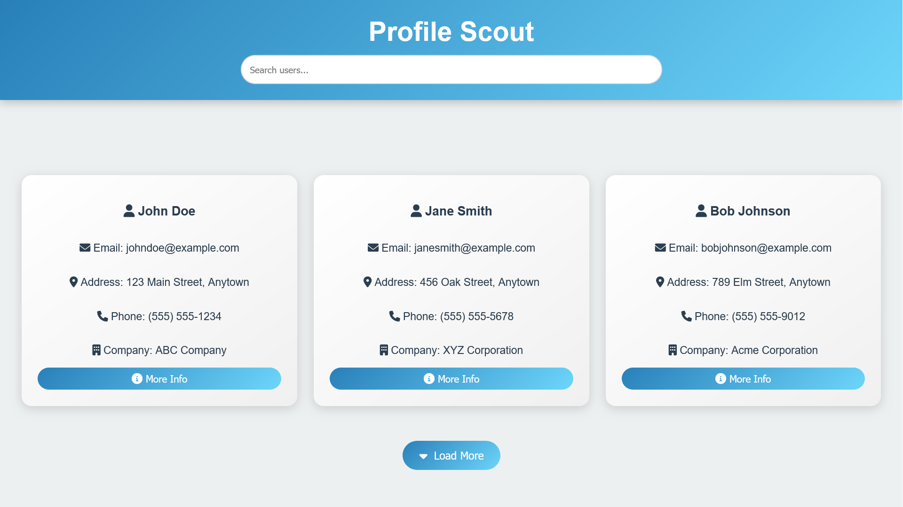
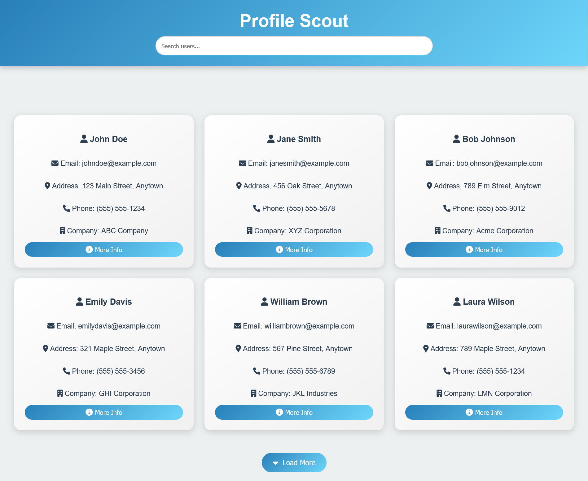
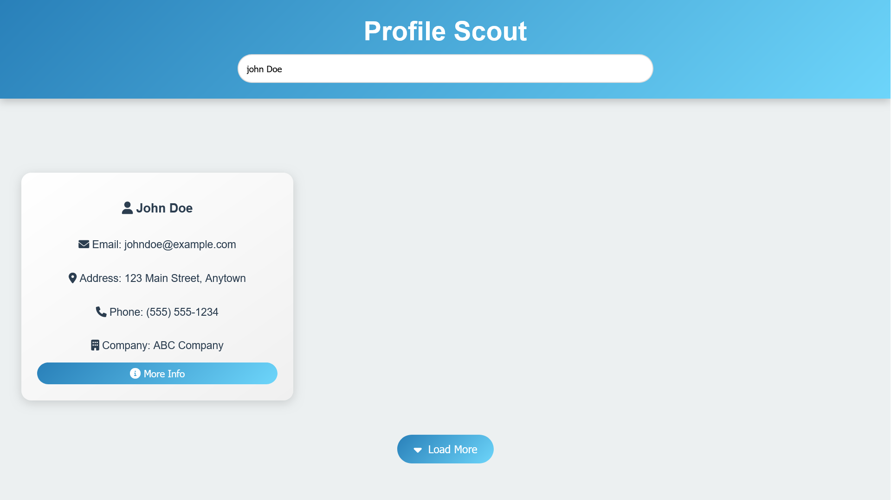

# Profile Scout

## Overview

Profile Scout is a web application designed to display a list of user profiles fetched from a placeholder API. It offers a searchable user list, the ability to load more profiles on demand, and a detailed profile view in a modal window.

## Features

- **Search Functionality**: Filter users by their first or last name in real-time.
- **Load More**: Retrieve additional user profiles with a button click.
- **Profile Modal**: View detailed information about users in a modal window.

## Screens

The app consists of the following screens:

1. **Home Screen**: 
    

2. **Load Button Screen**: 
    

3. **Search Input Screen**: 
    

## Topics

- **Web Development**
- **Frontend Development**
- **JavaScript**
- **Font Awesome**
- **API Integration**
- **Responsive Design**
  
## Technologies Used

- **HTML5**: Provides the structure of the web application.
- **CSS3**: Responsible for styling and responsive design.
- **JavaScript**: Manages interactivity and API requests.
- **Font Awesome**: Used for icons to enhance the user experience.

## API
The application uses the [JSONPlaceholder](https://www.jsonplaceholder.org/) API to fetch user data.
  
## Installation

1. **Clone the Repository**

   ```bash
   git clone https://github.com/MoSalem149v2/profile-scout_DEBI-Task.git
   cd profile-scout_DEBI-Task
